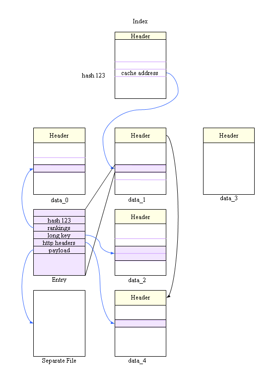

# Chromium Disk Cache

**如何从 `Chromium Disk Cache` 硬盘缓存获取祈愿链接的实现原理。**

> 以下内容目前是自己的研究和见解，如有错误和遗漏，欢迎补充。

## 简称

- `Chromium Disk Cache` 以下简称：`硬盘缓存`

## 目录

- [前言](#前言)
  - [什么是硬盘缓存](#什么是硬盘缓存)
  - [和原神有什么关系](#和原神有什么关系)
- [结构](#结构)
  - [了解硬盘缓存文件结构](#了解硬盘缓存文件结构)
  - [硬盘缓存的目录文件](#硬盘缓存的目录文件)
  - [索引文件](#索引文件)
  - [数据块文件](#数据块文件)
  - [存储条目](#存储条目)
- [实现](#实现)
- [参考](#参考)

## 前言

### 什么是硬盘缓存

> `磁盘缓存` 存储从 Web 获取的资源，以便以后可以在需要时快速访问它们。

引用自：[Overview](https://www.chromium.org/developers/design-documents/network-stack/disk-cache/#overview)

### 和原神有什么关系

在原神游戏内打开公告页面或者祈愿历史记录页面。其实就是一个名为 `ZFGameBrowser.exe` 的内置浏览器，它是基于 `Chromium` 内核的。所以这些页面的 URL 链接都会被存储在 `硬盘缓存` 里面。

## 结构

### 了解硬盘缓存文件结构

> This diagram shows a disk cache with 7 files on disk: the index file, 5 block-files and one separate file. data_1 and data_4 are chained together so they store blocks of the same size (256 bytes), while data_2 stores blocks of 1KB and data_3 stores blocks of 4 KB. The depicted entry has its key stored outside the EntryStore structure, and given that it uses two blocks, it must be between one and two kilobytes. This entry also has two data streams, one for the HTTP headers (less than 256 bytes) and another one for the actual payload (more than 16 KB so it lives on a dedicated file). All blue arrows indicate that a cache address is used to locate another piece of data.

图片和原文引用自：[The Big Picture](https://www.chromium.org/developers/design-documents/network-stack/disk-cache/#the-big-picture)

> 图片的原文说明对实际结构的理解可能会不太清楚，故不作翻译。详细请见下：

### 硬盘缓存的目录文件

| 文件名      | 结构      | 备注  |
| :--------: | :-------- | ----- |
| `index`    | 索引文件   | `Cache address` 缓存地址，哈希指针 |
| `data_0`   | 数据块文件 | `N/A` |
| `data_1`   | 数据块文件 | `Entry store` 存储条目 |
| `data_2`   | 数据块文件 | `Long key` 长密钥、长键、URL |
| `data_3`   | 数据块文件 | `N/A` |
| `data_4`   | 数据块文件 | `Http Headers` HTTP 头 |
| `f_000000` | 单独块文件 | `Payload` HTTP 有效载荷 |

### 索引文件

索引文件就是一个 `缓存地址表` 或者 `哈希指针表`。它由 `8192 字节的结构头` 和 `至少 65536 个缓存地址` 构成。但实际长度由结构头内的 `table_len` 字段控制。其每一个缓存地址对应数据块文件 `data_1` 中的指定 `Entry store` 存储条目数据。

#### 结构头

索引文件的结构头是一个 8192 字节的数据结构。

WIP...

#### 缓存地址

WIP...

### 数据块文件

WIP...

### 存储条目

WIP...

## 实现

WIP...

## 参考

WIP...
